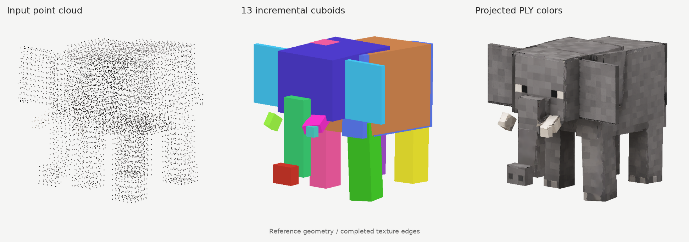

# Cuboid Approximation

Approximate a colored PLY point cloud with oriented cuboids and project its colors onto a UV atlas. Cuboids are appended in an immutable construction order: geometry and IDs already committed never change.

The fitting method rejects irreversible surface burial before commitment, compares refined finalists using a shared objective, and certifies exposed-area support with adaptive bounds. Local acquisition scales, support-plane orientation proposals and bounded candidate workspaces improve robustness to density differences and rotated symmetric objects. Search checkpoints preserve the immutable construction order.



The illustration uses a fixed 13-cuboid reference geometry with rebaked textures. It demonstrates color projection, not a new fitting result or a measurement of reconstruction quality.

## Run

The pinned environment supports Python 3.10–3.12. Use a virtual environment:

```bash
python -m pip install -c requirements-lock.txt .
python -m cuboid_approximation --ply examples/ComfyUI_00013/input.ply --output outputs/example
```

Replace `--ply` with XYZ, XYZ RGB or Gaussian-splat PLY data. XYZ-only inputs receive a neutral texture. Open `outputs/example/textured/cuboids_textured_3d.html` locally; the offline viewer begins at zero cuboids and its slider reveals construction order.

| Setting | Default |
|---|---:|
| `--target-coverage` | `0.999` |
| `--target-surface-support` | `0.95` |
| `--target-component-coverage` | `0` (disabled) |
| `--surface-max-evaluations` | `65536` |
| `--max-cuboids` | `128` |
| `--max-points` | `60000` |
| `--resolution` | `160` |
| `--max-frames` | `32` |
| `--seeds-per-frame` | `96` |
| `--point-tolerance-factor` | `2` |
| `--approximation-distance-factor` | `2` |
| `--atlas-size` | `2048` |
| `--reconstruction-mode` | `solid` |
| `--orientation-mode` | `pca` |
| `--edge-barriers` | enabled |
| `--color-space` | `srgb` |
| `--max-memory-mb` | `2048` |
| `--diagnostics` | disabled |

`python -m cuboid_approximation --help` lists all options. The lower default resolution fits ordinary isotropic objects within the default workspace budget; refinement uses continuous source coordinates, so the fitted face positions are not restricted to voxel boundaries. Higher resolutions remain available explicitly.

Final parameter NPZ, PLY and OBJ exports retain source coordinates and units. Fitting and reusable checkpoint states use normalized coordinates. The viewer normalizes before float32 conversion. GLB uses centered coordinates, +Y up and meters; use `--source-up=z` for Z-up data and `--units-per-meter 1000` for millimeters. The GLB root transform and `extras.source_origin` retain the reversible mapping to source coordinates.

## What counts as success

The point tolerance is twice the median nearest-distinct-point spacing unless `--point-tolerance` supplies an absolute tolerance in source units. A numerical floor follows the source extent. The tolerance is independent of voxel resolution and the normal-estimation sample budget. Use an explicit physical tolerance for comparisons between datasets with different acquisition densities.

A successful run must satisfy all of the following:

1. The requested fraction of **all retained observations**, including duplicates, is within tolerance of the union of cuboid volumes.
2. The requested **spatially weighted** fraction is within that same volume tolerance. Each occupied cell of width `2 * tolerance` contributes equal total mass, regardless of its observation count.
3. The requested spatially weighted fraction of source points is within tolerance of the **exterior surface** of the union.
4. At least `--target-surface-support` of the exposed surface area is supported by source points within tolerance. The adaptive lower bound must reach this target; a quadrature estimate alone cannot declare success.

The report separates these gates and reports coverage by connected spatial component. `--target-component-coverage` optionally imposes a minimum volume and source-surface coverage on every component at the evaluation scale. A dense patch cannot compensate indefinitely for an uncovered sparse patch. Points buried inside a large cuboid do not suffice to declare surface success.

Exit codes are `0` when all enabled targets pass, `3` for an exported partial model, and `2` for an input or processing error. `surface_quality_not_reached` explicitly identifies a model that reaches volume targets but fails the surface gate. For applications intentionally concerned only with volume proximity, `--target-surface-support 0` disables both surface checks; raw and spatial volume targets still apply.

The search is heuristic and reaching all targets is not guaranteed. Each proposed commitment is checked against all retained source points for irreversible burial inside the union. A resumed prefix that already exceeds the allowed buried mass reports `irreparable_frozen_prefix`. Increasing the cuboid budget alone cannot correct such a prefix. The bounded finalist search can also stop with `bounded_candidate_search_exhausted`; this is a search limit, not evidence that no feasible box exists.

## Preparation and orientation proposals

Non-finite coordinates and Gaussian splats with sigmoid opacity below `--min-opacity` (default 0.1) are discarded. The optional outlier filter compares each position's third-distinct-neighbor distance with the median third-neighbor distance of its local neighbors. This replaces the global density threshold, allowing coherent sparse components to coexist with dense components. `--outlier-distance-factor 0` disables filtering. Rejected source indices are recorded; very small isolated components can still be ambiguous.

Distinct indices and full-cloud spacing are calculated during loading and reused. Spatial sampling retains an original point nearest each occupied cell center, refining the cell size to use the budget. Scalar cell keys avoid repeatedly sorting three-column structured arrays. At least 20 distinct retained positions are required.

Normals use up to 30 distinct neighbors and a radius of six nearest-distinct-point spacings at each observation. Each covariance is normalized by its local spacing; duplicate observations do not distort normals. PCA includes the center point. Neighborhoods need eight neighbors, a nondegenerate tangent plane, and smallest covariance eigenvalue at most 0.3 times the second eigenvalue. Normal signs remain free.

The unsigned 90th-percentile normal variation marks edges at 30 degrees. It is computed when needed for regions or when `--diagnostics` is enabled. In `regions` mode, compatible normals and tangent-plane residuals form connected regions, using symmetric local-scale tests to avoid one-way connections between dense and sparse patches. Optional finite edge segments cut the graph; `--no-edge-barriers` disables this stage. Dominant support-plane pairs, region normals, in-plane PCA, global PCA and local PCA propose frames. Eigenvalue gaps determine whether PCA axes are reliable. Equivalent signed axis permutations are deduplicated. `--max-frames 1` requests the identity frame and skips additional orientation proposals. Unused border attachment and its parameters have been removed; requesting `attach_borders=True` through the Python API raises an explicit error.

`--orientation-mode pca` keeps its historical CLI name; it now combines support-plane proposals with reliable global/local PCA axes. This recovers rotated symmetric cuboids whose covariance cannot determine their orientation. Use `--orientation-mode regions` to enable additional region proposals. The benchmark tool compares it with regions and regions without edge barriers; the barrier stage is not assumed to improve every input.

## Reconstruction and certification

Voxel width is the longest source extent divided by the requested resolution. Observed support comes from point cells or capped 2.5-sigma splat ellipsoids. Principal splat scales are bounded by `max(voxel_width, 4 * full_spacing)`; invalid ellipsoids fall back to their center cells.

The reconstruction barrier has `max(shell_layers, ceil(0.75 * full_spacing / voxel_width))` layers. Its physical scale therefore follows acquisition spacing when the grid is refined. Solid mode fills only enclosed voids with 26-connectivity, then erodes by one more layer than the barrier. Surface mode skips enclosed-void filling and, with the surface quality gate enabled, limits each committed box's smallest dimension to twice the evaluation tolerance. This avoids explaining separated thin layers with one thick filled box. Observed thin structures are retained in both modes; this thickness constraint is not a general topology guarantee.

The reference is reconstructed interior union observed support. A bounded Euclidean dilation creates the admissible envelope. Every committed cuboid is checked against all excluded voxels intersecting its bounding box, using the separating-axis test. A summed-volume fast path accepts bounding regions that contain only admissible voxels; it does not weaken the certificate. Certification is repeated in export coordinates.

Support and padded-envelope bounds are checked before normal estimation. Candidate workspaces are split into overlapping spatial blocks when a rotated grid would exceed the budget or mostly span empty space. Seeds are distributed between blocks, occupied cells are streamed, and every candidate uses the unchanged global containment certificate. Resolution is not silently reduced. These are conservative workspace estimates, not an operating-system cap on total process memory. The reconstruction envelope remains dense: sparse scenes spanning large empty regions may still need lower resolution or separate processing. Reconstruction filling remains an assumption about material, not a proof of the topology of incomplete observations.

## Selection and candidate refinement

Initial candidates grow from spatially distributed interior and surface seeds in each orientation. Selection prescreens a bounded, diverse shortlist using conservative cell bounds, then compares refined finalists with the same surface-aware objective. Exact full-cloud checks precede commitment. Conservative spatial neighborhoods and unchanged-frame projections are reused; exact supports and objective scores share a bounded cache. Near-threshold points are recomputed directly to preserve tolerance semantics. Surface checks update affected source points while preserving exact tolerance classifications; full distances are refreshed when scoring needs them. The report includes cache bytes, hits, spatial queries, projection counts and `surface_distance_work` counters.

A certified tight single box that already passes the surface checks skips all rotated-grid candidate generation. This avoids the full orientation search for an already exact cuboid.

Spatial coverage gain is penalized by exterior volume, source-surface error and unsupported exposed area. The exterior cost scales with actual volume outside the reference, avoiding a large fractional penalty for an almost zero-thickness panel on a voxel boundary. The surface objective accounts for newly exposed faces and the retained exposed faces of earlier boxes. Its reverse penalty grows monotonically with integrated error relative to a fixed estimate of observed area, so adding area cannot dilute existing errors. Source-distance improvements count within the evaluation tolerance; moving an unsupported face toward a distant observation alone earns no gain. A finalist can shrink to observed coordinate bounds or robust quantiles, move individual faces, translate, and test small local rotations. Joint trims through 5% allow several faces to cross a feasibility plateau together before individual face moves. Certified face expansion and export-coordinate retreat happen before the final comparison, so a runner-up can win after refinement. Seed, refined and expanded alternatives remain available until exact validation; a failed expansion does not discard a valid earlier alternative. The report records these choices in `selected_alternatives`. The final box must pass strict containment and the exact union-surface burial check before it becomes immutable.

Observed surface panels complement the maximal-volume candidates. Thin projection layers are separated into spatial components, and unsupported or concave bounding rectangles are split under a fixed budget. Residual proposals are injected every four committed cuboids and when the current pool is exhausted. Residual cells are selected spatially rather than by raw population; local PCA adds orientations for thin or oblique residual patches. If both refined shortlists fail, up to eight small boxes around uncovered observations receive a direct check, preserving an opportunity for safe progress outside that shortlist. They still need positive gain and the same containment and union-surface checks. This remains a finite heuristic, not a proof of the minimum number of boxes or an optimum union volume.

Final surface evaluation subtracts overlapping boxes from each face and triangulates the remaining polygons. Internal contact faces are removed; coincident exterior faces have a single owner. Source-to-surface distances use continuous point-to-triangle queries accelerated by a bounding-volume hierarchy. Adaptive triangle subdivision bounds supported area using the Lipschitz property of distance to the source cloud. The report distinguishes `reached`, `not_reached` and `inconclusive`; uncertain area remains unknown if the work or depth budget is exhausted. Increase `--surface-max-evaluations` to allow more subdivision and tighter bounds. Deterministic area quadrature is retained separately for reverse RMS and an estimated support fraction. No exact Hausdorff bound is claimed.

## Texture projection and viewer

Full-cloud normals are transferred from several nearby valid, tangent-compatible representatives. Invalid nearest representatives no longer erase otherwise valid support. Unresolved points receive a bounded local PCA fallback. If this still fails, a well-formed planar Gaussian can supply its measured minor-axis normal: its smallest scale must be at most half the second-smallest. Isotropic or malformed kernels cannot supply this fallback. Radius comparisons include a small numerical margin so rotating a regularly sampled plane does not exclude neighbors exactly on the cutoff. Normal confidence contributes to projection weights. For XYZ samples without a valid Gaussian covariance, compatible tangent-neighbor spacings determine an anisotropic footprint; its normal variance is unchanged, and neighbors on incompatible depth layers cannot enlarge it.

Measured Gaussian axes are no longer capped at twice the nearest-center spacing: that discarded valid elongated footprints and left holes. Axes retain a floor of `0.35 * local_spacing`; implausible kernels whose longest standard deviation exceeds the source extent retain the protective `2 * local_spacing` cap. All compatible footprints are rasterized using their projected three-sigma ellipses, including footprints centered outside an isotropic neighborhood. Adaptive tiles limit candidate source/texel pairs to 65536; a single texel can retain more donors, evaluated in bounded chunks. No nearest-neighbor quota silently discards a sparse layer.

Thick parts use layers ordered by distance to the fitted face. Broad faces of thin slabs use outward-visible layers: the nearest surface can otherwise be the reverse skin when a fitted face crosses the source object, as on the elephant's right ear. A face uses this policy when its cuboid thickness is at most one quarter of its shorter edge. Its donors must be as close to that cuboid as to any other cuboid, within `0.75 * local_spacing`, so a neighboring part cannot replace an observed skin's colors. Where no owned observation exists, the bounded nearest-surface color remains as an unsupported fallback.

Layers are separated using the finer donor spacing. Colors within a layer use opacity, normal alignment and projected covariance, then composite by remaining transmittance. For outward-visible slabs, the Gaussian footprint also attenuates opacity: its weak tail must not become an opaque disk. Layer opacity uses a maximum rather than a sum to avoid duplicate/density-dependent transparency. The final RGB is conditioned on observed material rather than an invented black background. This is a surface-color estimate, not camera-dependent 3D Gaussian rendering. Competing equally near layers can still mark a texel uncertain. Local interpolation obeys the same eligibility and layer rules and is bounded by each donor's acquisition spacing. Texels with no eligible donor remain gray. Without camera visibility or reliable surface topology, color-layer ambiguities cannot all be resolved.

Gap interpolation measures its radius in the face plane after checking depth eligibility, so an accepted fitting offset does not consume the sampling radius. Remaining edge gaps can borrow color from a confident adjacent source plane that meets the actual cuboid edge within `0.75 * local_spacing`. Both the donor and the target must stay within `4 * local_spacing` in 3D, and the target must lie within that radius of the edge. This pass preserves depth and opacity eligibility, layer compositing and existing colors.

After projection, uncolored texels near a cuboid edge can copy the closest existing color on their own chart or a directly adjacent chart of the same cuboid. Adjacent faces are unfolded around their shared edge: the distance follows the surface instead of cutting through a thin ear to its reverse skin. Both the edge band and the donor distance are limited to `2.5 * surface_tolerance`. Only original chart colors donate, so completion cannot spread repeatedly. An explicit observation mask preserves real gray pixels and all existing colors. These appearance estimates remain unsupported and orange in the confidence atlas; the report records their fraction separately. Gaps beyond that distance remain neutral gray.

Input RGB and SH-DC color values are interpreted as sRGB by default; use `--color-space linear` for linear values. The SH-DC conversion is `clip(0.5 + 0.28209479 * f_dc, 0, 1)` before applying that declared color convention. Projection and interpolation blend in linear light, and the PNG atlas is encoded as sRGB. The viewer also encodes linear source-point colors as sRGB, keeping cloud and textured-model displays consistent.

A free-rectangle packer places the six padded charts per cuboid. Co-oriented coplanar overlaps have one render owner: the earliest cuboid. Later patches are clipped and retain their original UV mapping in OBJ, GLB, the viewer and the figure renderer, preventing depth-buffer flicker. This changes only render triangulation, not centers, dimensions, rotations, original corners or construction order. Earlier construction prefixes remain intact; the viewer uses actual per-cuboid vertex counts rather than assuming 12 triangles per box. Completely redundant or proven hidden faces receive minimum-size neutral charts. Each chart needs at least 4 × 4 pixels plus four padding pixels on each side. Insufficient atlas capacity is reported as an error.

The confidence atlas marks unambiguous projection in green and uncertain, interpolated or unobserved texels in orange. Support area excludes removed coplanar patches and faces proven hidden in every construction prefix; older whole-face percentages need to be recomputed on that same area before comparison. It is a support diagnostic, not a color-accuracy guarantee. The offline viewer filters sRGB textures in linear light and uses mipmaps capped at level two, matching the four-pixel gutters. The portable GLB retains linear filtering because glTF's core sampler cannot express that mip-level cap.

## Interrupted runs and compatible resume

```bash
python -m cuboid_approximation --ply examples/ComfyUI_00013/input.ply \
  --resume outputs/example --output outputs/continued --max-cuboids 256
```

Repeat non-default fitting settings. Resume always writes to a new directory. Compatibility signatures separate preparation and fitting from texture/viewer exports. They check input, geometric implementation, relevant dependencies, Python major/minor version and fitting settings. Artifact checksums, retained source-row identities, normalization and final/local geometry consistency are also verified. A viewer, texture or Pillow change does not invalidate geometric caches. Full code and environment provenance is still recorded. Fitting checkpoints must match the geometric implementation to be resumed.

Atomic checkpoints are written before selection and after every committed box. Two alternating state files and an atomically replaced manifest retain the last complete state across an interrupted write. Compatible runs reuse preparation, normalized envelope, orientations and candidates. A crash before initial candidate generation completes still requires that stage to restart.

Box budget, coverage targets, surface evaluation budget, diagnostics, atlas size, memory budget, export coordinates and color-space interpretation may change at resume. `--max-cuboids` limits the total model size, including its frozen prefix. Existing committed geometry remains frozen. Textures are baked again and are not immutable across runs. Completed geometry and checkpoints remain available if texture export fails.

To rebake a completed geometric stage without running fitting or rebuilding the envelope:

```bash
python -m cuboid_approximation --ply examples/ComfyUI_00013/input.ply \
  --rebake outputs/example --output outputs/retextured --atlas-size 4096
```

`--rebake` verifies the source, retained source rows and saved artifacts, copies geometric parameters byte for byte, and keeps their original provenance. Geometry settings and quality measurements remain those of the saved run. Only the export stage runs again, using the current texture implementation; the old fitting implementation need not be installed. `--rebake` and `--resume` are mutually exclusive; both require a new output directory.

## Outputs

| Output | Content |
|---|---|
| `textured/cuboids_textured.glb` | Centered, +Y-up model in meters with embedded texture |
| `textured/cuboids_textured.obj` | Source-coordinate OBJ, MTL and atlas |
| `textured/cuboids_textured_3d.html` | Offline viewer with construction slider |
| `textured/texture_atlas.png`, `textured/projection_confidence.png` | Color atlas and projection-support diagnostic |
| `textured/texture_parameters.npz`, `textured/texture_report.json` | Preserved cuboid geometry, atlas layout and projection metrics |
| `cuboids/parameters.npz` | Ordered centers, dimensions, rotations, corners and distances |
| `cuboids/envelope.npz` | World-coordinate reference and admissible envelope |
| `checkpoint.json` | Atomic manifest, provenance and checksums |
| `cuboids/checkpoint-*.npz` | Alternating normalized search states |
| `cuboids/envelope-local.npz` | Reusable normalized envelope |
| `preparation/` | Essential sampled points, normals, regions and filtering report |
| `preparation/*.ply`, `preparation/edges.npz`, `preparation/barriers.npz` | Optional visualization/debug data with `--diagnostics`; barrier data only when that stage runs |
| `report.json` | Configuration, provenance, timings and separate quality gates |

## Validation and benchmarks

```bash
python -m unittest discover -s tests -v
python tools/benchmark.py --strict --case cube --case rotated_cube --ablation \
  --output outputs/quality --resolution 32
python tools/benchmark.py --strict --output outputs/full-quality --ablation
python tools/benchmark.py --ply examples/ComfyUI_00013/input.ply \
  --point-tolerance 0.03125122468918562 \
  --output outputs/example-benchmark --resolution 64
```

The synthetic corpus includes a cube, noisy and rotated cubes, a rotated box, L shape, hollow shell, thin appendage, close colored layers, a partial corner and components with different sampling densities. Analytic source surfaces and checks for empty space, thin details and atlas color are independent of the production union mesh. Physical tolerances stay fixed across resolutions. `--ablation` compares regions, regions without barriers and PCA. The default strict mode exits with code 1 when any quality contract fails, including exported partial results. `--exploratory` explicitly allows recording unmet contracts without failing the command; processing errors still fail. Each summary records failures, parameters, code hashes, dependencies, quality and timings. Timings are environment-dependent; geometry metrics and texture-support definitions must match before comparing runs.

The benchmark uses an explicit area-certificate budget of 262144 evaluations by default. This allows dense reference surfaces to obtain decisive bounds without changing their physical tolerance or acceptance targets; the application default remains 65536. Both tools expose `--surface-max-evaluations`.

Browser and official Khronos GLB validation:

```bash
python -m pip install '.[validation]'
python -m playwright install chromium
npm install --no-save gltf-validator@2.0.0-dev.3.10
python tools/validate_exports.py --run outputs/quality/cube-regions
```

Linux CI runs the cube and rotated cube in all three orientation variants with strict quality checks, validates GLB structure and exercises all viewer modes and the construction slider in Chromium. The Python suite also covers irreversible union-surface burial, refined finalist comparisons, conservative area bounds, local density scales, bounded support caches and candidate grids, anisotropic color footprints, reconstruction under refinement, linear-light blending, interruption recovery and incompatible checkpoint rejection.

The local review validation passed 159 Python tests and 30 of the 33 strict corpus runs. Only the three volumetric L variants still failed: their reverse surface support or texture support did not meet every contract. The main L variant now covers all source surface points, but its conservative reverse-support bound remains insufficient. Cube and rotated-cube GLB validation reported no errors or warnings, and their viewer controls passed in Chromium. The complete records, source hashes, environment, before/after probes and real-input comparison are in [review validation records](docs/review-validation-0.4.json). These remaining failures are recorded as failures; this is not a fully passing quality corpus.

The real input remains a regression at the matched 16-cuboid budget: source-surface coverage is 68.65% versus 86.62% previously, and observed elapsed time is 441.7 s versus 56.3 s. Raw volume coverage is 63.20% versus 99.94%. Irreversibly buried spatial mass is now 0.0987%, below the 0.1% allowance; the earlier run had at least 12.54% buried mass. Texture support improved from 67.53% to 78.69%. The new run exhausts the box budget and remains partial. Timings were measured under shared-machine load; the added guarantees and local query savings have not produced an overall speed or reconstruction-quality improvement on this input.

The subsequent texture-only correction passed 172 Python tests and the three targeted strict cases (cube, rotated cube, close colored layers). Both real-input GLBs validated with zero errors or warnings, and Chromium exercised every construction prefix and all viewer modes. On the unchanged 13-cuboid reference at 2048², unambiguous support improved from 84.27% to 85.82%, recomputed over identical retained render patches; 13955 previously unresolved normals were recovered from planar kernels. This is not a color-accuracy measurement or a speedup claim. Source, geometry, implementation and image hashes, commands and measured results are recorded in [`docs/texture-validation.json`](docs/texture-validation.json). The existing partial fit remains partial after rebaking; no geometry quality gate is waived.

The edge-color correction passed 180 Python tests and those same three strict cases. With identical reference geometry, UVs, cloud and confidence atlas, neutral RGB166 pixels decreased from 9.47% to 6.26% of retained charts, and from 21.47% to 11.56% in their outer four-pixel bands. At that stage, both broad ear faces had less than 1.6% neutral pixels. These counts measure a neutral-gray proxy, not color accuracy; genuinely unobserved regions can remain gray. GLB and Chromium checks passed on both reference and current geometry. Hashes and measurements are in [`docs/texture-edge-validation.json`](docs/texture-edge-validation.json).

The subsequent right-ear correction addresses reverse-side colors hiding its front texture, which neutral-pixel counts did not detect. The [before/after comparison](docs/images/ear-texture.png) shows the recovered pattern. On 3535 source samples from the ear's outer skin, mean absolute RGB error decreased from 0.1687 to 0.0101. Only the two broad ear charts changed in the reference; geometry, UVs and the other 76 chart colors are identical. All 185 tests, three strict quality cases and both GLB/viewer checks passed. Thin-slab support now uses stricter donor ownership; unowned observations retain local colors only as unsupported fallback. Measurements, limits and hashes are in [`docs/texture-visibility-validation.json`](docs/texture-visibility-validation.json).

The latest [edge completion comparison](docs/images/texture-edge-completion.png) addresses the remaining neutral strips on cuboid edges. Uncolored texels in the bounded edge band decreased from 134,356 to 191 on the reference, measured with explicit observation masks. Existing colored texels, geometry, UVs and the confidence atlas are unchanged. All 190 tests, three strict quality cases and the distribution build pass. Both reference and current GLBs have no errors or warnings, and both interactive viewers pass the Chromium checks. The main illustration now includes this completion. Details and limitations are in [`docs/texture-edge-completion-validation.json`](docs/texture-edge-completion-validation.json).

Archived validation results, an offline viewer and a GLB are in [`examples/validation`](examples/validation). Their [`comparison.json`](examples/validation/comparison.json) and [`metadata.json`](examples/validation/metadata.json) retain the commands and provenance of the recorded run. Another model and its metrics are available in [`examples/ComfyUI_00013`](examples/ComfyUI_00013). Only the main illustration has been rebaked with the current texture implementation, on unchanged reference geometry.

To render figures from a completed run:

```bash
python -m pip install '.[docs]'
python tools/illustrate.py --run outputs/example --output docs/images
```

Use `--pipeline-only` to replace only the main image. `--texture-dir outputs/retextured/textured` selects a separately rebaked atlas; its original corners must match the illustrated run. `--caption` can describe the illustrated geometry and texture explicitly.

Use `--diagnostics` on the fitting run to include edge and region diagnostic plots. The essential preparation arrays are retained without it; optional PLY/debug exports are omitted.

Source: [`src/cuboid_approximation`](src/cuboid_approximation). CPU implementation. [MIT license](LICENSE).
